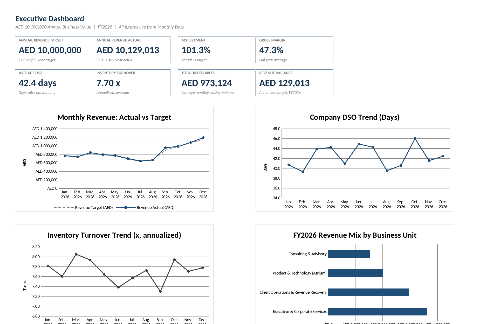

# 📊 Executive Business Intelligence Ecosystem

A full, connected financial reporting model in Excel  built around a demonstration scenario of **AED 10,000,000** in annual business value across four business units. Not a single static sheet: a proper data pipeline from raw transactions to an executive ready dashboard, entirely formula-driven.

## Why This Exists

Most "KPI dashboard" templates are one tab with a few typed-in numbers. This is what the reporting infrastructure actually looks like behind a real executive dashboard: a documented set of assumptions, a raw fact table, an aggregation layer, and a presentation layer each one only ever reading from the layer below it.

## How It's Structured

| Tab | Purpose |
|---|---|
| **Read Me** | How the model flows, and what's safe to edit |
| **Assumptions** | Single source of truth  revenue share by unit, COGS %, credit terms, DSO & inventory turnover targets, monthly seasonality |
| **Monthly Data** | The fact table  48 rows (12 months × 4 business units), 17 columns. Revenue, receivables, and inventory are actuals; every ratio is a live formula |
| **KPI Tracker** | Company-wide monthly rollup, aggregated automatically via `SUMIFS` / `AVERAGEIFS` |
| **Business Unit Analysis** | Full year performance side by side, with a comparison chart |
| **Executive Dashboard** | Scorecards + 4 live charts  nothing on this tab is a typedin number |

**916 formulas. Zero manual totals. Zero calculation errors.**

## What's on the Dashboard

- Annual Revenue Target vs Actual, Achievement %, Gross Margin
- Average DSO (Days Sales Outstanding), Inventory Turnover, Total Receivables, Revenue Variance
- Monthly Revenue trend (Actual vs Target)
- DSO trend across the year
- Inventory Turnover trend
- Revenue mix by business unit

Design is intentionally minimal — navy, charcoal, and gray only. No bright colors, no clutter.

## Use It

1. Download `Executive-BI-Ecosystem-AED10M.xlsx`
2. Start on the **Assumptions** tab  change the annual value, unit shares, or targets and everything downstream recalculates
3. Add a new month or business unit on **Monthly Data** by copying the formula pattern from the row above; the Tracker, Analysis, and Dashboard tabs pick it up automatically

## Data Note

All monetary values are illustrative, generated for this demonstration and clearly documented in the workbook  hardcoded inputs are shown in blue text throughout, every calculated cell is a blacktext formula.

---

Built by [Cindy Sheil C.](https://www.linkedin.com/in/csofong/) — Operations & Executive Support Strategist
